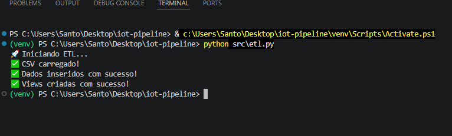
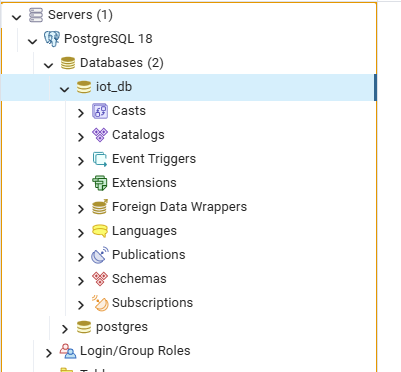
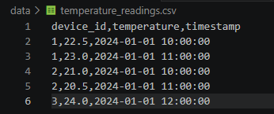
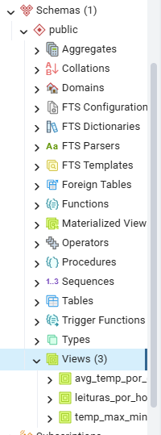
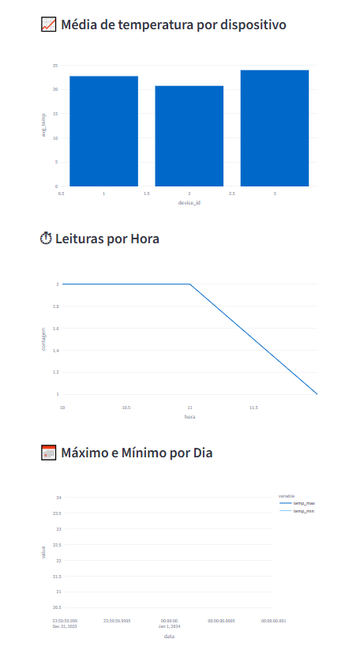

# 📊 IoT Analytics Pipeline

## 📌 Descrição do Projeto

Este projeto implementa um pipeline de dados (ETL) utilizando Python e PostgreSQL para processar dados de sensores IoT (temperatura), armazená-los em banco de dados e disponibilizá-los em um dashboard interativo.

---

## 🚀 Tecnologias Utilizadas

* Python
* Pandas
* PostgreSQL
* SQLAlchemy
* Streamlit
* Plotly
* Docker

---

## ⚙️ Estrutura do Projeto

```
iot-analytics-pipeline/
│
├── data/
│   └── temperature_readings.csv
│
├── src/
│   ├── etl.py
│   └── dashboard.py
│
├── sql/
│   └── create_views.sql
│
├── docs/
│   ├── etl.png
│   ├── pgadmin.png
│   ├── temperature_table.png
│   ├── views.png
│   └── dashboard.png
│
├── requirements.txt
└── README.md
```

---

## 🔄 Pipeline ETL

### 1. Extração

Leitura do arquivo CSV contendo dados de temperatura de dispositivos IoT.

### 2. Transformação

* Limpeza de dados
* Padronização de colunas
* Conversão de tipos

### 3. Carga

Inserção dos dados no banco PostgreSQL.

---

## 🗄️ Banco de Dados

Tabela principal:

* `temperature_readings`

Views utilizadas:

* `avg_temp_por_dispositivo`
* `leituras_por_hora`
* `temp_max_min_por_dia`

---

## 🐳 Docker (PostgreSQL)

### 🔧 Executar PostgreSQL com Docker

```bash
docker run --name postgres-iot -e POSTGRES_PASSWORD=False157 -p 5432:5432 -d postgres
```

### 🔌 Configuração de conexão

* Host: localhost
* Porta: 5432
* Usuário: postgres
* Senha: False157
* Banco: iot_db

---

## ▶️ Como Executar o Projeto

### 1. Instalar dependências

```bash
pip install -r requirements.txt
```

### 2. Executar ETL

```bash
python src/etl.py
```

### 3. Criar as Views

Execute o arquivo:

```
sql/create_views.sql
```

### 4. Executar Dashboard

```bash
streamlit run src/dashboard.py
```

---

## 📊 Dashboard

O dashboard apresenta:

* Média de temperatura por dispositivo
* Leituras por hora
* Temperatura máxima e mínima por dia

---

## 📸 Capturas de Tela

### 🔹 Execução do Processo ETL



---

### 🔹 Estrutura do Banco (pgAdmin)



---

### 🔹 Dados na Tabela temperature_readings



---

### 🔹 Views Criadas



---

### 🔹 Dashboard Interativo



---

## 📦 Base de Dados

A base utilizada está localizada em:

```
/data/temperature_readings.csv
```

Caso necessário, pode-se utilizar datasets públicos:
https://www.kaggle.com/

---

## 🧪 Comandos Git Utilizados

```bash
git init
git add .
git commit -m "Projeto completo IoT Analytics Pipeline"
git branch -M main
git remote add origin https://github.com/JONATHA-RICHARD/iot-analytics-pipeline.git
git push -u origin main
```

---

## 👨‍💻 Autor

Projeto desenvolvido para fins acadêmicos.
